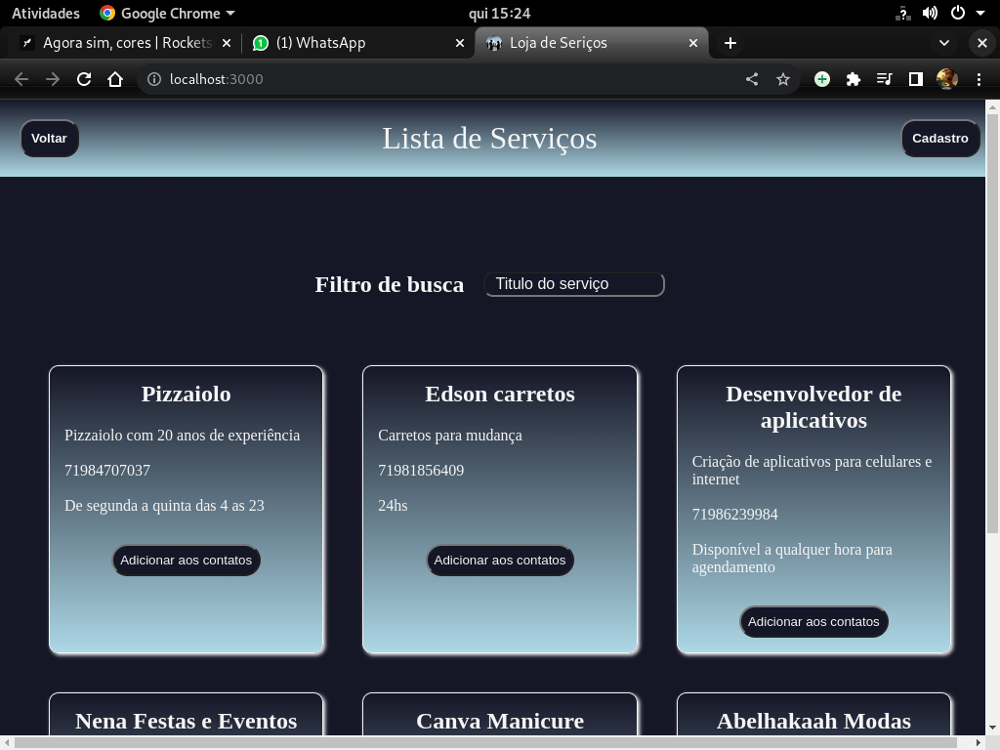

<!DOCTYPE html>
<html>
<head>
</head>

<body>
	<h1>Projeto fullstack</h1>
    Aplicativo para cadastramento e contratação de serviços diversos.
	<ul>
		<li>Pagina inicial:
Introdução do aplicativo, com cabeçalho o qual é padronizao em todas as páginas. Esse cabeçalho leva o nome do app e dois botões o da homepage e o do carrinho que redireciona o usuário à página do carrinho de serviços adicionados. 
		 
		No corpo da página há dois botões que levam à página de cadastramento de serviços e a lista de serviços cadastrados.

		</li>
		<li>Cadastro e lista de serviços:
		A página de cadastro é onde se colhe os dados para adição de um serviço no marketplace. O corpo da página também possui dois botões. Um para cadastrar o serviço que finaliza e outro para a página onde estão listados todos os serviços disponíveis no marketplace. 
		
		 
		A página onde estão listados os serviços também possui um filtro composto por 3 campos e um select. Onde é possível filtrar os serviços por preço e título, através dos campos e ordenar por prazo, preço e ordem afabética de título através do select. Em cada serviço há dois botões, um para levar à página de contratação do serviço e outro para adicionar o serviço ao carrinho.</li>
		<li>Página de detalhes, contratação e consulta de serviços:
		</li>
	</ul>	
</body>
</html>

>Link do deploy da aplicação: https://mypersonaldeploys.herokuapp.com/