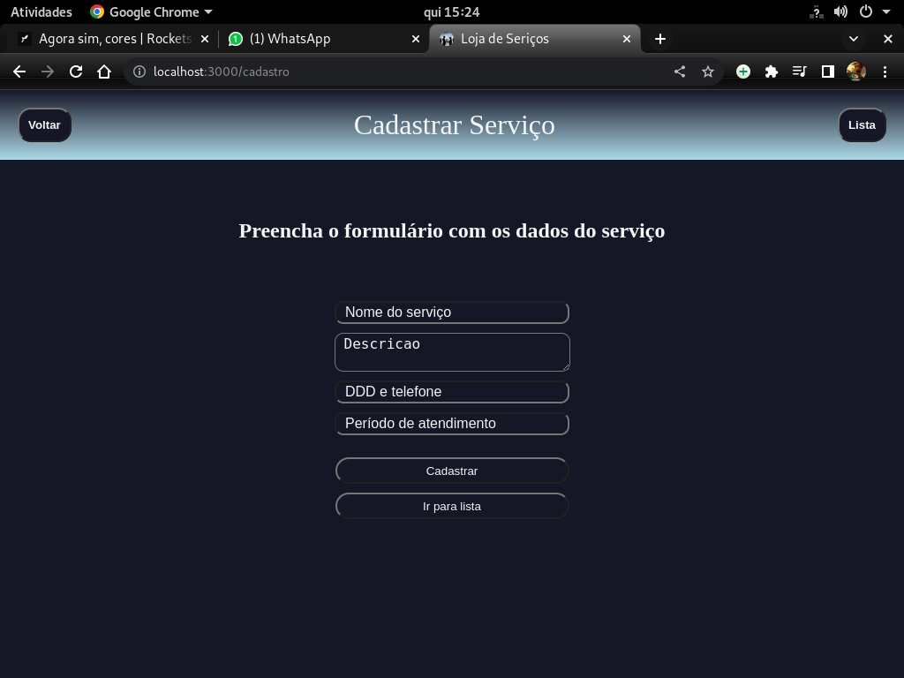

<!DOCTYPE html>
<html>
<head>
</head>

<body>
	<h1>Loja de Serviços (fullstack)</h1>
    

		Aplicativo para cadastramento e contratação de serviços diversos.
		Na página inicial se tem acesso a lista de serviços cadastrados e através do botão de cadastro situado no canto superior direito da tela você é redirecionado para página de cadastro onde é possível cadastrar um serviço prestado por você ou sua empresa.
	
 
		
	  
</body>
</html>

>Link do deploy da aplicação: https://loja-de-servicos.onrender.com/
